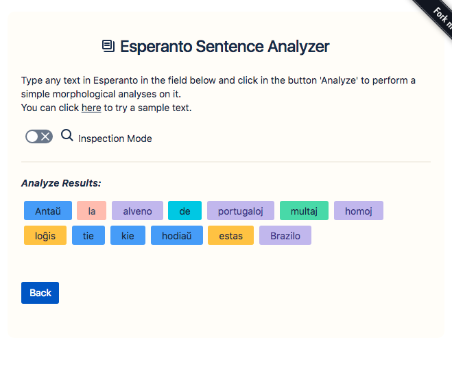

# Esperanto Analyzer - React

## About

This React application is the front-end for the Pythonlibrary [esperanto-analyzer](https://github.com/fidelisrafael/esperanto-analyzer).

You can try the demo at: https://fidelisrafael.github.io/esperanto-analyzer-react/



---

[](https://forthebadge.com) [](https://forthebadge.com) [](https://forthebadge.com)


## Development Setup

```bash
$ git clone https://github.com/fidelisrafael/esperanto-analyzer-react
$ cd esperanto-analyzer-react
$ yarn install
$ yarn start
``` 

The application will run at `http://localhost:3000`

**OBS**: If you're not hosting the Python WEB API at port `5000` you will probably want to use the
Heroku hosted API, for this update `src/Config.js` and set `developmentConfig` as follow:

```js
const developmentConfig = {
  api_host: 'esperanto-analyzer-api.herokuapp.com',
  api_protocol: 'https'
}
```

---

## :calendar: Roadmap <a name="roadmap"></a>

- :white_medium_small_square: Write tests
- :white_medium_small_square: Update this Roadmap with more plans


---

## :thumbsup: Contributing

Bug reports and pull requests are welcome on GitHub at https://github.com/fidelisrafael/esperanto-analyzer-react. This project is intended to be a safe, welcoming space for collaboration, and contributors are expected to adhere to the [Contributor Covenant](contributor-covenant.org) code of conduct.

---

## :memo: License

The project is available as open source under the terms of the [MIT License](http://opensource.org/licenses/MIT).

